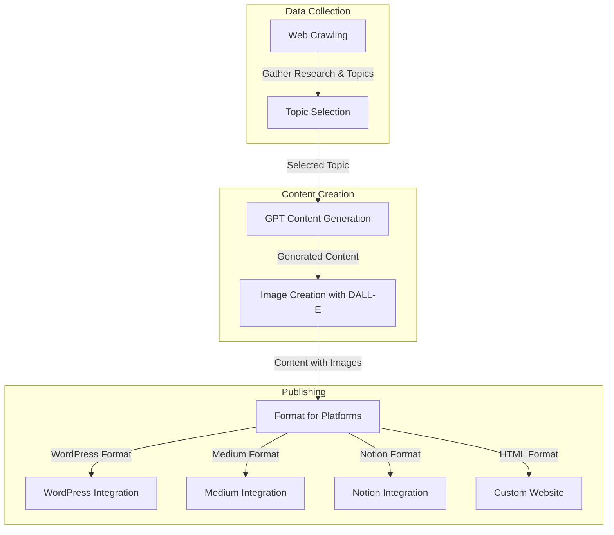

This diagram shows the workflow of the AI-powered content generation system:

1. **Data Collection Phase**: Web crawling gathers research data and potential topics, followed by intelligent topic selection.
2. **Content Creation Phase**: Content is generated using GPT models, and relevant images are created with DALL-E.
3. **Publishing Phase**: Content is formatted according to platform requirements and published to WordPress, Medium, Notion, or custom websites.

The modular design allows users to execute individual steps or the entire workflow automatically. 